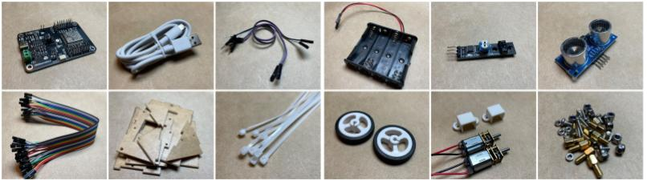
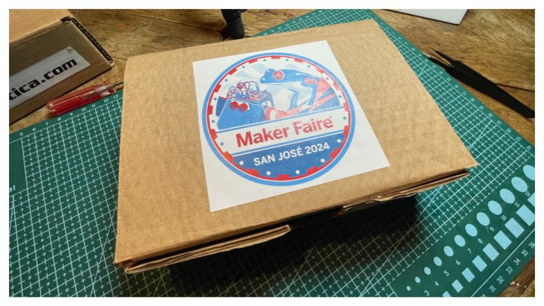
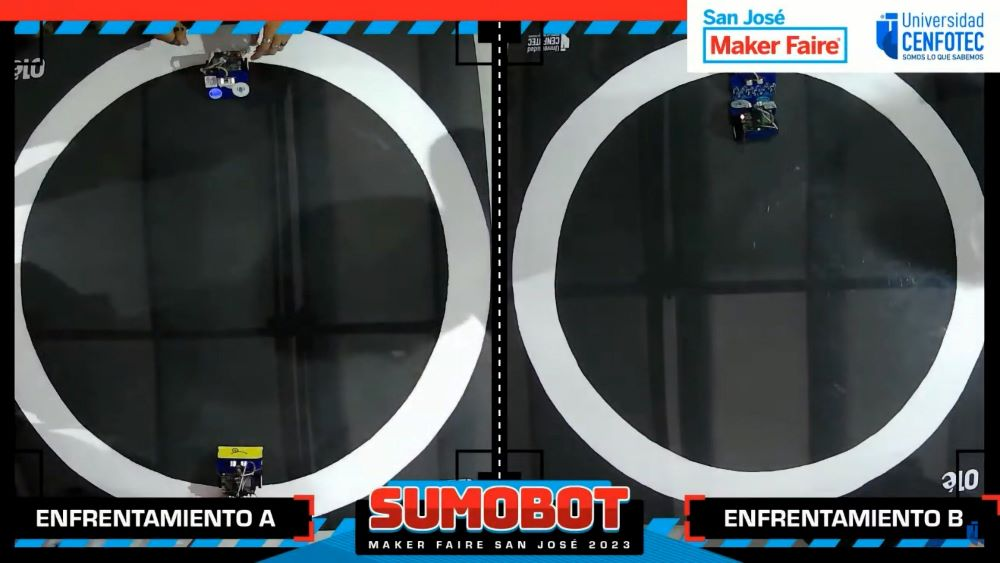
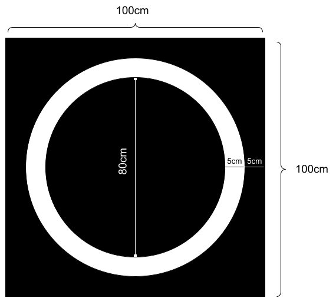
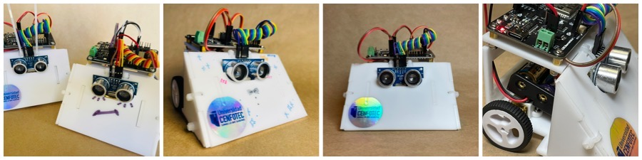

# Código y Diseños del Sumobot

El Sumobot es un robot simple, 100% desarrollado en Costa Rica, para competencias colegiales de Sumobot. Fue diseñado por el profesor Tomás de Camino Beck para la Universidad Cenfotec como parte de un programa de transformación educativa, con el objetivo de ampliar las capacidades de pensamiento computacional tanto en estudiantes de colegio como en estudiantes universitarios.

El Sumobot utiliza la placa [IdeaBoard](https://github.com/CRCibernetica/circuitpython-ideaboard/wiki), desarrollada por CrCibernética. Esta placa, que es Open Source, tiene un ESP32 como microcontrolador y facilita la conexión de sensores, motores y su programación a través de USB o Wi‑Fi.

Puede ver este [video resumen](https://youtu.be/L98O-mApjXQ) de la primera competencia de Sumobot de Costa Rica, celebrada en el Maker Faire San José 2023.

---
## Componentes del Sumobot 2025

El Sumobot de el 2025 es un modelo nuevo, con más sensores y capacidades comparado con el Sumobot del 2024.

- Por Definir...

---

## Componentes del Sumobot 2024

- [IdeaBoard (ESP32)](https://www.crcibernetica.com/crcibernetica-ideaboard/)
- Cable USB C
- Tiras de plástico de 2.5 mm
- Tornillos y tuercas para colocar la placa IdeaBoard
- Tornillos adicionales para sostener los motores
- 2 x soportes de motor microgear
- 2 x [micro motores](https://www.crcibernetica.com/micro-gearmotor/) de 200 RPM
- 2 x ruedas
- Soporte de 4 baterías AA
- [Sensor IR](https://www.crcibernetica.com/track-sensor-module/)
- [Sensor ultrasónico](https://www.crcibernetica.com/hc-sr05-ultrasonic-distance-sensor/) de distancia (HCSR04)
- Piezas de acrílico de 3 mm ([Ver archivo de corte láser](https://github.com/Universidad-Cenfotec/Sumobot/blob/main/archivos_de_fabricacion/chasis_sumobot.svg))

Todos los componentes se pueden encontrar en Costa Rica en [CrCibernética](https://www.crcibernetica.com/sumobot-universidad-cenfotec/). [Aquí pueden ver un video](https://youtu.be/N60gXp_uzeo?si=2TApsz6n20wZ9ZoX) de los componentes que vienen como parte del kit.

---

## Chasis del Sumobot

El archivo "Sumobot_Chasis.svg" está en formato SVG para corte láser del chasis de Sumobot. Se puede cortar tanto en acrílico, MDF u otro material de 3 mm de espesor.

También, con el archivo [chasis_sumobot_2025_3D.stl](https://github.com/Universidad-Cenfotec/Sumobot/blob/main/archivos_de_fabricacion/chasis_sumobot2025_3D.stl) pueden imprimir el chasis en una impresora 3D. Esto facilita agregar estructuras más complejas que no son posibles en 2D.

El chasis del robot se une con tiras (gasas/zip ties) de plástico de 2.5 mm, lo que facilita el armado, la reparación o la modificación de algunas partes.

---

# Armando el Sumobot

Pueden ver [este video detallado](https://youtu.be/m4y3BSPjgoc?si=vLK6NNjRJQF1DbDc) de cómo armar el Sumobot.

## Kit Sumobot

El Kit Sumobot es creación de la Universidad CENFOTEC y lo distribuye CrCibernetica.com. Si desean adquirir el kit, pueden contactar libremente a CrCibernetica.

## Esquema de conexiones

- El sensor infrarrojo se conecta en el IO033.
- El sensor ultrasónico se conecta en el IO026 (trig) e IO025 (echo).
- Los motores se conectan en Motor 1 y Motor 2 (con posiciones invertidas).

## Baterías
Las baterías se conectan: el cable rojo al pin marcado como "+" y el negro al pin "-", como se muestra en el siguiente esquema:

## Software para programar el Sumobot

Para programar el Sumobot se utiliza Thonny, el cual se puede descargar desde este [enlace](https://thonny.org/).

### Instrucciones:
- Descargar la última versión de Thonny.
- Instalar.
- Una vez instalado, ir al menú "Herramientas > Opciones" o "Tools > Options" en inglés.
- En la pestaña "Intérprete" (o "Interpreter" en inglés), seleccionar "CircuitPython (Generic)".
- ¡Listo!
- [Video con detalles](https://youtu.be/Zc3oaAbVAdc)

## Código

El código "code.py" está desarrollado en CircuitPython. CircuitPython es un subconjunto de Python desarrollado para microcontroladores y facilita la portabilidad y programabilidad de dispositivos como el ESP32, entre otros. El Sumobot ya viene preparado para trabajar con CircuitPython y no es necesario cargar archivos adicionales. Si por alguna razón se debe "reflashear" el IdeaBoard, siga las instrucciones en este [enlace](https://github.com/CRCibernetica/circuitpython-ideaboard/wiki/3.-Installation).

El código "hcsr04.mpy" corresponde a la librería para el sensor de distancia, el cual se utiliza para detectar otro robot que esté al frente del Sumobot.

### Funciones Básicas

- **wiggle(t, n, speed):** Hace que el bot se mueva de izquierda a derecha durante _t_ segundos, a velocidad _speed_, repitiéndolo _n_ veces.
- **forward(t, speed):** Mueve el bot hacia adelante durante _t_ segundos a velocidad _speed_.
- **backward(t, speed):** Mueve el bot hacia atrás durante _t_ segundos a velocidad _speed_.
- **left(t, speed):** Mueve el bot hacia la izquierda durante _t_ segundos a velocidad _speed_.
- **right(t, speed):** Mueve el bot hacia la derecha durante _t_ segundos a velocidad _speed_.
- **stop():** Detiene el bot.
- **randomTurn(t, speed):** Gira al azar a la izquierda o a la derecha durante _t_ segundos a velocidad _speed_.
- **lookForward():** Realiza la lectura del sensor ultrasónico y retorna la distancia en cm de lo que esté en frente del bot.
- **scan():** Rota hacia un lado hasta que detecta algo adelante o hasta que gire un número determinado de veces.
- **forwardCheck(t, speed):** Mueve hacia adelante, pero verifica, mediante el sensor IR, que no se salga del dojo. Cuando detecta el borde, realiza un movimiento hacia atrás y luego gira.

### Recuperar la configuración inicial

Si por alguna razón se desea resetear el Sumobot a los archivos iniciales, cargue, a través de Thonny en el dispositivo CircuitPython (con el Sumobot conectado), todos los archivos que vienen en el archivo ZIP "SumoBot_Device_Files.zip".

---

## Videos Instructivos
- [Cómo instalar Thonny](https://youtu.be/Zc3oaAbVAdc)
- [Conectar el Sumobot a Thonny](https://youtu.be/SpIcqRKmczk)
- [Instalando las baterías del Sumobot](https://youtu.be/ndWJ0q0M8CI)
- [Calibrando el sensor infrarrojo](https://youtu.be/XXJbzzaVefk) 
- [El código principal del Sumobot](https://youtu.be/86sQCr-bjjk)
- [CircuitPython: Programando el LED RGB](https://youtu.be/5ezFqexHwQE)
- [Programando el sensor infrarrojo](https://youtu.be/1JA3G-FPpJ4)
- [Programando el sensor ultrasónico](https://youtu.be/RwY2lEPkyg8)
- [Motores DC con el Sumobot](https://youtu.be/MybJACeDIgA)

---

# Competencia SumoBot

## Formato de competición

- El torneo SumoBot se estructura como un torneo por eliminatoria.
- Dos robots compiten en un "dojo". El robot que sea sacado del ring, que deje de funcionar o que no tenga posibilidad de movimiento, pierde.
- Se define una llave previa en la que los equipos serán asignados al azar.
- Denominamos "set" a cada encuentro entre dos robots.
- Cada set consiste en 3 juegos (matches) de un minuto y medio, con una pausa de un minuto entre cada juego para ajustes o cambios de estrategia.
- El "dojo" es un ring circular de 80 cm de diámetro, con fondo negro y una línea de borde blanca de 5 cm. De esta manera, los robots pueden identificar cuándo están dentro o fuera del ring y detectar el borde mediante un sensor infrarrojo.
- Este archivo PDF contiene el diseño del [Mini‑Dojo](https://github.com/Universidad-Cenfotec/Sumobot/blob/main/circulo_10cmEspesor.pdf). El Mini‑Dojo se puede utilizar para probar diferentes ideas y garantizar que el robot funcione, pero siempre se debe tener en cuenta que el dojo de la competencia es mucho más grande y, además, cuenta con una lámina de acrílico de 3 mm.

## Principios del juego

- La mesa de arbitraje revisará el robot para determinar que cumple con las especificaciones requeridas.
- Son tres combates por partida, y se gana por puntos.
- Un robot perderá si es removido del dojo más allá de la línea blanca del borde o si no ejecuta ningún movimiento durante el tiempo asignado.
- Cada batalla tiene una duración máxima de 1 minuto y 30 segundos.
- En caso de empate (si ninguno de los robots es sacado del dojo), la mesa de arbitraje considerará ganador al robot con mayor número de ataques.
- Las tres acciones de batalla son: atacar, defender y buscar.
- La competencia es por eliminación, y los equipos se clasifican en pares hasta la final.
- El código de los dos primeros lugares será publicado de forma abierta en este GitHub, con el fin de ir mejorando el nivel año con año.

---

# Reglamento

## DEFINICIONES:
1. **Sumobot:** El robot Sumobot es un robot de combate autónomo programado por el usuario, que deberá sacar a su rival del área de combate (dojo), ya sea empujándolo, arrastrándolo o dejándolo inhabilitado.
2. **Partida:** Enfrentamiento entre 2 robots de diferentes equipos, dividido en 3 combates.
3. **Maker Space:** Laboratorio de innovación de la Universidad CENFOTEC.
4. **GitHub:** Plataforma para crear proyectos abiertos de herramientas y aplicaciones, caracterizada, sobre todo, por sus funciones colaborativas que ayudan a que todos puedan aportar su granito de arena para mejorar el código.
5. **Mesa de arbitraje:** Persona o grupo de personas con autoridad, responsables de presidir el juego desde un punto de vista neutral y de tomar decisiones sobre la marcha que hagan cumplir las reglas de este reglamento.
6. **Dojo:** Área de combate, el espacio formado por la tarima circular y un espacio circundante denominado "área exterior de seguridad".
7. **Ronda:** Sistema en torneos en el que el perdedor de un encuentro queda inmediatamente eliminado de la competición, mientras que el ganador avanza a la siguiente fase. Se juegan rondas y, en cada una de ellas, se elimina a la mitad de los participantes hasta dejar un único competidor que se corona como campeón.

## ESPECIFICACIONES DEL ROBOT
1. Los robots son entregados por la Universidad CENFOTEC. Los colegios deben armar los robots siguiendo las instrucciones publicadas por la Universidad CENFOTEC en GitHub.
2. El peso del robot, incluyendo la caja y las baterías, es de 260 g. El peso debe mantenerse siempre entre 260 y 290 gramos. Al agregar otros sensores, el peso puede aumentar ligeramente (por ejemplo, un sensor ultrasónico pesa aproximadamente 8.5 gramos).
3. No se permiten modificaciones estructurales en el robot. Se puede adaptar para colocarle más sensores, pero no se permiten agregar puntas o extensiones para otros propósitos.
4. Se pueden agregar sensores adicionales que no impliquen modificaciones en la estructura del robot.
5. No se pueden cambiar los neumáticos o las ruedas del robot, para asegurar condiciones de igualdad entre los robots y que el ganador se determine por estrategia.
6. No se pueden cambiar los motores.
7. No se puede utilizar otro tipo de baterías.
8. Cada robot será revisado antes de cada competencia.
9. En situaciones especiales respecto a las especificaciones del robot, su estructura y funcionamiento, que no estén claramente definidas en las reglas, se decidirá a criterio unificado de los jueces.

## REGLAS DEL JUEGO
1. Un fiscal revisará cada robot para asegurarse de que cumple con las especificaciones requeridas. En caso de duda, será verificado por los jueces.
2. Cada partida consta de tres combates. En cada combate, a cada equipo se le asignan 3 puntos por ganar, 1 punto en caso de empate y 0 puntos por perder.
3. Al iniciar la partida, el equipo debe programar el robot para que espere 3 segundos antes de comenzar sus movimientos y actividades.
4. Un robot pierde si es removido del dojo más allá de la línea blanca del borde, si no ejecuta ningún movimiento durante el tiempo asignado o si queda inmovilizado por el oponente.
5. Cada batalla tiene una duración máxima de 1 minuto y 30 segundos.
6. En caso de empate en un combate, cada equipo gana 1 punto.
7. La competencia inicia por grupos, y las siguientes rondas son por eliminación, en las que los equipos avanzan en pares hasta la final.
8. Cada combate comienza de manera diferente: primero, con los robots frente a frente a una distancia aproximada de 10 cm; luego, espalda con espalda; y, finalmente, lado a lado, con los robots viendo en direcciones opuestas.
9. Entre cada combate se dispone de 1 minuto para revisar el robot y realizar posibles cambios.
10. Si en una partida los equipos quedan empatados por puntos, se hará la rifa por moneda.
11. De todos los equipos que perdieron en la primera ronda, se escogerá (por definir) un número de los segundos mejores.
12. Si en una partida uno de los equipos no se presenta, ganará automáticamente el que sí se presentó (obtendrá 9 puntos por partida en la primera ronda o pasará a la siguiente ronda a partir de la segunda ronda).
13. Si un equipo llega tarde a la primera partida, podrá presentarse a las siguientes, pero se le asignará la derrota en la primera partida.
14. Si en una partida ninguno de los equipos se presenta, para la siguiente ronda se seleccionarán los mejores segundos lugares.

## SANCIONES Y APELACIONES
1. Si un equipo no se presenta para un "match" en el día del evento, el equipo oponente clasificará automáticamente.

## DISPOSICIONES FINALES
Este evento tiene como objetivo colaborar, apoyar y estimular a la comunidad, por lo que cada colegio representado podrá recibir apoyo de sus oponentes en el momento en que éstos lo manifiesten. Los docentes pueden ayudar y asesorar a sus equipos. Se espera que los docentes permitan y estimulen a sus estudiantes a realizar el 100% del trabajo.

---

# Preguntas Frecuentes

1. **¿El código se puede modificar?**  
   R: Sí, se puede modificar.

2. **¿Se pueden agregar partes al robot?**  
   R: No se permiten modificaciones estructurales del robot. Se puede adaptar para colocarle más sensores, pero no se permiten agregar puntas o extensiones para otros propósitos.

3. **¿Se puede modificar el hardware?**  
   R: Se pueden agregar sensores adicionales que no impliquen modificaciones en el robot (por ejemplo, modificar el chasis). Es decir, se pueden incorporar a la estructura del chasis sin agregar nada más. Cada robot será revisado antes de cada torneo de competencia.

4. **¿Se pueden agregar sensores de toque, por ejemplo?**  
   R: Se pueden agregar sensores adicionales que no impliquen modificaciones en el robot.

5. **¿Los estudiantes llevan la programación hecha o la memorizan?**  
   R: Los estudiantes llevan el programa hecho y, en el mismo evento, pueden modificar la programación. Si no cuentan con computador, se les facilitará uno en el evento.

---

# Algunas cosas por mejorar
- Algunos motores presentan problemas y generan un corto.
- Los cables de los motores deben ser más largos. Por el momento se están utilizando extensiones.

---

[Nombre del proyecto]

# Licencia

Sumobot es un robot desarrollado con el propósito de potenciar el aprendizaje de computación en colegios. Este proyecto está abierto a contribuciones y estamos encantados de recibir nuevas ideas.

Este robot está protegido por una licencia Creative Commons. Específicamente, se trata de la licencia CC BY‑NC‑SA 4.0, que significa Atribución‑NoComercial‑CompartirIgual 4.0 Internacional.

Bajo esta licencia, se permite el uso, distribución y modificación del robot, pero con las siguientes condiciones:
- **Atribución** — Debes dar el crédito correspondiente, proporcionar un enlace a la licencia e indicar si se han realizado cambios.
- **NoComercial** — No puedes utilizar el material para una finalidad comercial.
- **CompartirIgual** — Si remezclas, transformas o creas a partir del material, debes distribuir tus contribuciones bajo la misma licencia que el original.

Para obtener más detalles sobre la licencia, por favor visita [https://creativecommons.org/].

# Contribuciones

Si estás interesado en contribuir al Sumobot, por favor revisa las guías de contribución disponibles en la sección de "Documentación". Todas las contribuciones son bienvenidas, sin importar cuán pequeñas sean. Juntos podemos hacer que Sumobot sea mejor para todos.

