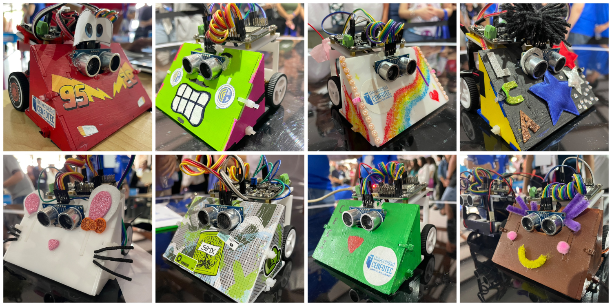

# ¿Que es el SumoBot de CENFOTEC? (o CenfoBot)

El Sumobot es un robot simple, 100% desarrollado en Costa Rica, para competencias colegiales de Sumobot. Fue diseñado por el profesor Tomás de Camino Beck para la Universidad Cenfotec como parte de un programa de transformación educativa, con el objetivo de ampliar las capacidades de pensamiento computacional tanto en estudiantes de colegio como en estudiantes universitarios.

El Sumobot utiliza la placa [IdeaBoard](https://github.com/CRCibernetica/circuitpython-ideaboard/wiki), desarrollada por CrCibernética. Esta placa de código abierto (Open Source) incorpora un microcontrolador ESP32 y permite la conexión sencilla de sensores y motores, así como su programación mediante USB o Wi‑Fi.

Para el montaje del robot, se emplea un *shield* de robótica especialmente diseñado por la Universidad CENFOTEC (por el profesor Tomás de Camino Beck) en colaboración con CrCibernética. Este componente puede [adquirirse en este enlace](https://www.crcibernetica.com/sumobot-shield/).

Puede ver este [video resumen](https://youtu.be/L98O-mApjXQ) de la primera competencia de Sumobot de Costa Rica, celebrada en el Maker Faire San José 2023. Y acá pueden ver un [video resumen](https://youtu.be/9zarR0cKY90?si=D4UTzPx91h4megWT) de la segunda edición en el 2024

---

## Contenidos de este Repositorio

- [Componentes del Sumobot](https://github.com/Universidad-Cenfotec/Sumobot/blob/main/componentes2025.md)
- [Armado del Sumobot](https://github.com/Universidad-Cenfotec/Sumobot/blob/main/armado_2025.md)
- [Conexiones del Sumobot](https://github.com/Universidad-Cenfotec/Sumobot/blob/main/conecciones.md)
- [Programación del Sumobot](https://github.com/Universidad-Cenfotec/Sumobot/blob/main/programacion.md)
- [Programación en C/C++ (Avanzado)](https://github.com/Universidad-Cenfotec/Sumobot/tree/main/c%C3%B3digos_de_ejemplo_c%2B%2B/sumobot)
- [Códigos de ejemplo y códigos IdeaBoard](https://github.com/Universidad-Cenfotec/Sumobot/tree/main/c%C3%B3digos_de_ejemplo)
- [Sobre los 4 sensores infrarrojos](https://github.com/Universidad-Cenfotec/Sumobot/blob/main/c%C3%B3digos_de_ejemplo/sensores_infrarrojos.md)
- [Explicación de un código base del Sumobot (buen inicio para programar)](https://github.com/Universidad-Cenfotec/Sumobot/blob/main/c%C3%B3digos_de_ejemplo/movimiento_base.md)
- [Cómo calibrar los sensores infrerrojos, grabando los datos](https://youtu.be/5G9ZTyPEq5s?si=Cqf4HQZEF9e04VTD)
- [Especificaciones del Dojo](https://github.com/Universidad-Cenfotec/Sumobot/blob/main/dojo.md)
- [Reglas del Torneo Sumobot](https://github.com/Universidad-Cenfotec/Sumobot/blob/main/reglas_2025.md)
- [Preguntas frecuentes](https://github.com/Universidad-Cenfotec/Sumobot/blob/main/FAQ.md)
- [Playlist de Videos de Sumobot](https://www.youtube.com/watch?v=Cxlyzh-E9kE&list=PLySA0noR1JGVZg5L3hGVwRD3PP2ibNYMT)

## Contenidos Avanzados
- [Control PDI de motores y navegación](https://github.com/Universidad-Cenfotec/Sumobot/blob/main/c%C3%B3digos_de_ejemplo/Control_Movimientos.md)
- [Almacenamiento de datos en el robot para análisis posterior](https://github.com/Universidad-Cenfotec/Sumobot/blob/main/c%C3%B3digos_de_ejemplo/almacenando_datos.md)
- [Ejemplo de automatización de vehiculos asistidos](https://github.com/Universidad-Cenfotec/Sumobot/tree/main/c%C3%B3digos_de_ejemplo/AGVs)

## Retos

- Hacer una estrategia de "scan" del contrincante más eficiente
- Hace movimientos oscilatorios para tratar de levantar al oponente
- Utilizar giroscopios para movimientos exactos ([ver este código](https://github.com/Universidad-Cenfotec/Sumobot/blob/main/c%C3%B3digos_de_ejemplo/Control_Movimientos.md))
- Utilizar el "botón 0" para que arranque el robot apenas suelten el botón ([ver este código](https://github.com/Universidad-Cenfotec/Sumobot/blob/main/c%C3%B3digos_de_ejemplo/code_boton0.py))
- Entender que cada combate inicia diferente y aprovechar esas posiciones
- Estudiar comportameinto de sensores almacenando los datos ([ver este código](https://github.com/Universidad-Cenfotec/Sumobot/blob/main/c%C3%B3digos_de_ejemplo/almacenando_datos.md))

## Algunos Saberes Escenciales de el Sumobot

| Área de Conocimiento                     | Saberes Esenciales                                                                     | Ejemplos desde el Kit Sumobot                                                                              |
| ---------------------------------------- | -------------------------------------------------------------------------------------- | ---------------------------------------------------------------------------------------------------------- |
| **1. Pensamiento Computacional**         | - Estructuras de control - Modularidad - Algoritmos - Programación de eventos | `code.py`, `retroceso.py`, `code_boton0.py`, `code_set_pixel_to.py`, uso de funciones en todos los scripts |
| **2. Robótica y Electrónica**            | - Lectura de sensores - Control de motores - Interacción hardware-software  - Precepción del entorno   - Calibración de sensores    - Interacción con otros agentes   - Menjo de incertidumbre  | `code_ultrasonic.py`, `code_acc_motor_move.py`, `Control_Movimientos.md`, `Pixel_colores.py`               |
| **3. Ciencia de Datos**                  | - Registro de datos - Análisis y visualización - Experimentación  - Desiciones basadas en datos                | `code_storage.py`, `code_storage_IR.py`, `almacenando_datos.md`, ejemplo de uso con Google Sheets          |
| **4. Matemáticas Aplicadas**             | - Lógica binaria - Cálculo de gradientes - Estimación de distancia  - Sistemas de control  - Integral y derivada              | `code_lecturaIR_4Bit.py`, `code_gradiente.py`, `Calculo _Gradiente.md`, `code_ultrasonic.py`               |
| **5. Ingeniería de Sistemas**            | - Diseño e integración de componentes - Diagnóstico y prueba de sistemas  - Verificación de errores  - Interacción humano máquina  - Sistemas complejos   - Programación Asistida IA  - Inteligencia Artificial         | `code_diagnostic.py`, `SumoBot_Device_Files.zip`, `movimiento_base.md`, `libreria IdeaBoard.md`            |
| **6. Habilidades Transversales (STEAM)** | - Resolución de problemas - Trabajo en equipo - Comunicación técnica  - Autodeterminación            | Uso de Markdown (`*.md`), documentación clara, posibilidad de trabajo colaborativo y creativo con el robot |

---

# Licencia

Sumobot es un robot desarrollado con el propósito de potenciar el aprendizaje de computación en colegios. Este proyecto está abierto a contribuciones y estamos encantados de recibir nuevas ideas.

Este robot está protegido por una licencia Creative Commons. Específicamente, se trata de la licencia CC BY‑NC‑SA 4.0, que significa Atribución‑NoComercial‑CompartirIgual 4.0 Internacional.

Bajo esta licencia, se permite el uso, distribución y modificación del robot, pero con las siguientes condiciones:
- **Atribución** — Debes dar el crédito correspondiente, proporcionar un enlace a la licencia e indicar si se han realizado cambios.
- **NoComercial** — No puedes utilizar el material para una finalidad comercial.
- **CompartirIgual** — Si remezclas, transformas o creas a partir del material, debes distribuir tus contribuciones bajo la misma licencia que el original.

Para obtener más detalles sobre la licencia, por favor visita [https://creativecommons.org/].

# Contribuciones

Si estás interesado en contribuir al Sumobot, por favor revisa las guías de contribución disponibles en la sección de "Documentación". Todas las contribuciones son bienvenidas, sin importar cuán pequeñas sean. Juntos podemos hacer que Sumobot sea mejor para todos.

