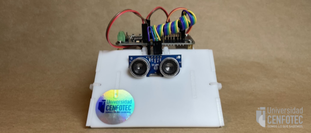
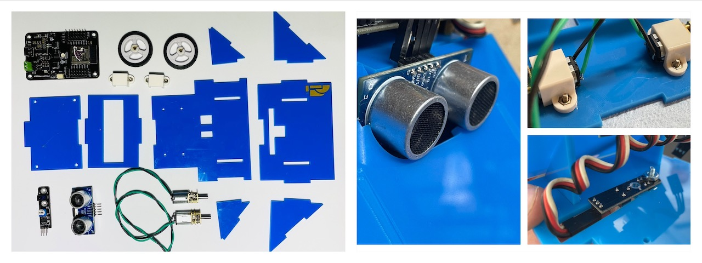
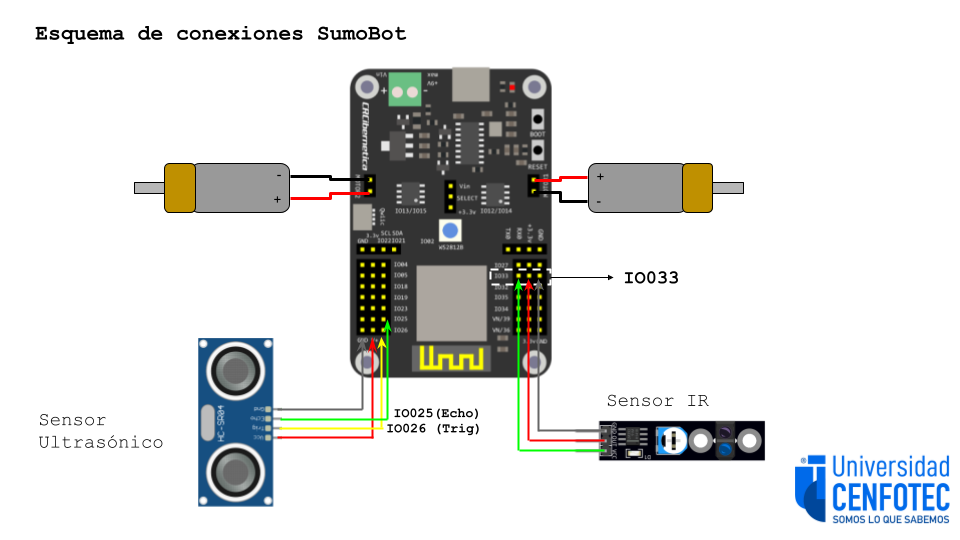
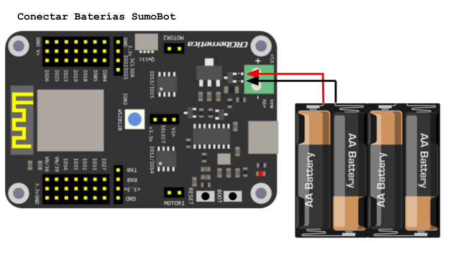
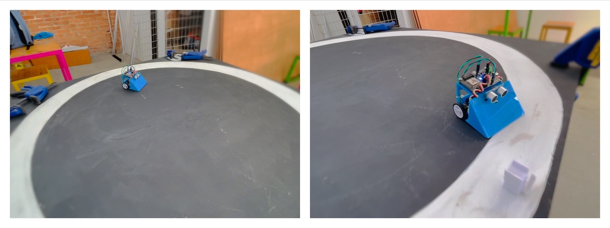
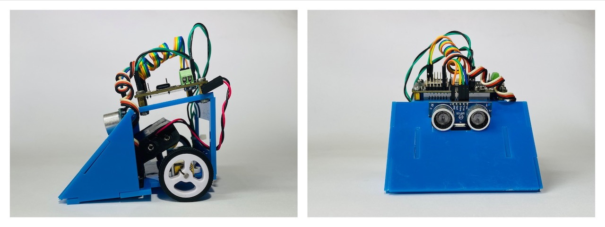

# Código y Diseños del Sumobot

El Sumobot es un robot simple, 100% desarrollado en Costa Rica, para competencias colegiales de sumobot. Fue diseñado por el profesor Tomás de Camino Beck para la Universidad Cenfotec como parte de un programa de transformación educativa con el objetivo de ampliar capacidades de pensamiento computacional tanto en estudiantes de colegio como en estudiantes de la universidad.

El Sumobot utiliza la placa [IdeaBoard](https://github.com/CRCibernetica/circuitpython-ideaboard/wiki), desarrollada por CrCiberética, esta placa que es Open Soruce tiene un ESP32 como microcontrolador, y facilita la conexión de sensores, motores y su programación a través de USB o Wifi.

## Componetes del Sumobot 
- [IdeaBoard (ESP32)](https://www.crcibernetica.com/crcibernetica-ideaboard/)
- 2 x [Micro motores](https://www.crcibernetica.com/micro-gearmotor/) de 200 RPM
- [Sesnor IR](https://www.crcibernetica.com/track-sensor-module/)
- [Sensor ultrasónico](https://www.crcibernetica.com/hc-sr05-ultrasonic-distance-sensor/) de distanca (HCSR04)

Todos los componetes se puede encontrar en Costa Rica en CrCibernética. 

## Chasis del SumoBot

Archivo "Sumobot_Chasis.svg" está en formato SVG para corte láser del chasis de Sumobot.  Se puede cortar tanto en acrílico como MDF u otro material con espesor de 3mm. 

También con el "Sumobot_Chasis3D.stl" pueden utilizar imprimir el chasis en impresora 3D. Esto facilita agregar estructuras más complejas que no son posibles en 2D.

## Esquema de conexiones

- el sensor ifrarojo va conectado en el IO033
- El sensor ultrasónico conectado en IO026 (trig) y I0025(Echo)
- Los motores van en Motor 1 y Motor 2 (con posiciones invertidas)

## Baterías
- Las baterías se conectan, el cable rojo al pin marcado como "+" y el negro al pin "-", como se muestra en el siguiente esquema:

## Software para programar el Sumobot

Para programar el sumobot se utiliza Thonny, el cua pueden descargar en este [link](https://thonny.org/)

### Instrucciones:
- Descargar la última versión de Thonny
- Instalar
- Una vez instalado, ir al menú "Herramientas > Opciones" o "Tools > Options" en inglés
- En la pestaña de "Intérprete" (o "Interpreter" en inglés), seleccionar "CyrcuitPyton (Generic)"
- Listo!
- [Video con detalles](https://youtu.be/Zc3oaAbVAdc)

## Código

El código "code.py" está desarrollado en CircuitPython. Circuit Python es un subconjunto de Python desarrollado para microcontroladores, y facilita la portabilidad y programabilidad de micrcontroladores como el ESP32 y otros. El Sumobot ya viene preparado para trabajar con Circuit Python y no hay que cargar archivos adicionales. Si por alguna razón debe "reflashear" el IdeaBorad, siga las instrucciones en este [link](https://github.com/CRCibernetica/circuitpython-ideaboard/wiki/3.-Installation)

El código "hcsr04.mpy" corresponde a la librería para el sensor de distancia. Que se utiliza para detectar otro robot que esté al frente del sumobot.

### Funciones Básicas

- wiggle(t,n,speed) Hace que el bot se mueva izqiuerda derecha pot tiepo t (segundos), velocidad speed, n veces
- forward(t,speed) Mueve el bot hacia adelante por tiepo t (segundos), velocidad speed
- backward(t,speed) Mueve el bot hacia atras por tiepo t (segundos), velocidad speed
- left(t,speed) Mueve el bot hacia la izquierda por tiepo t (segundos), velocidad speed
- right(t,speed) Mueve el bot hacia la derecha por tiepo t (segundos), velocidad speed
- stop() detiene el bot
- randomTurn(t,speed) Gira izq o der al azar, por tiempo t y velocidad speed
- lookForward() Hace una lectura del sensor ultrasónico y retorna la distancia en cm de lo que esté en frente del bot
- scan() Rota hacia un lado hacta que detecte algo adelante, o gire un núero determinado de veces
- forwardCheck(t, speed) Mueve hacia adelante, pero verifica con el sensor IR que no se salga del dojo.  Cuando detecta el borde hace un movimiento hacia atras y luego gira.

### Recuperar la configuración inicial

Si por alguna razón quiere resetear el Sumobot a los archivos iniciales, cargue a través de Thonny en el CircuitPython Device (el sumobot conectado) todos los archivos que vienen en el archivo ZIP "SumoBot_Device_Files.zip"

## Videos Instructivos
- [Cómo instalar Thonny](https://youtu.be/Zc3oaAbVAdc)
- [Conectar el Sumobot a Thonny](https://youtu.be/SpIcqRKmczk)
- [Instalando las baterías del Sumobot](https://youtu.be/ndWJ0q0M8CI)
- [Calibrando el sensor infrrarojo](https://youtu.be/XXJbzzaVefk) 
- [El código principal del Sumobot](https://youtu.be/86sQCr-bjjk)
- [CircuitPython: Programando el LED RGB](https://youtu.be/5ezFqexHwQE)
- [Programando el sensor infrarrojo](https://youtu.be/1JA3G-FPpJ4)
- [Programando el sensor ultrasónico](https://youtu.be/RwY2lEPkyg8)
- [Motores DC con el Sumobot](https://youtu.be/MybJACeDIgA)

# Competencia SumoBot

## Formato de competición

- El torneo SumoBot se estructura como un torneo por eliminatoria.
- Dos robots compiten en un "Dojo". El que es sacado del ring, o deja de funcionar, pierde
- Los encuentros de dos robots iniciales se seleccionan al azar
- Los encuentros de dos robots los denominamos "Set"
- Cada Set consiste de 3 juegos (Match) de un minuto y medio, con una pausa de un minuto entre juegos, para ajustes o cambios de estrategia
- El “Dojo” es un ring circular de 120 cm de diámetro, de fondo negro, con 10 cm de linea de borde blanca. De esta manera los robots pueden indentifica cuando están dentro o fuera del ring, y detectar el borde a través de un sensor infrarojo.
- En este archivo PDF tiene el dise;o del [Mini-Dojo](https://github.com/Universidad-Cenfotec/Sumobot/blob/main/circulo_10cmEspesor.pdf). El mini-Dojo se puede utilizar para probar diferentes ideas y garantizar de que funciona el robot, pero siempre se debe tener en cuenta que el dojo de la competencia es mucho más grande.

## Especificaciones del Robot
- El robot es cronstruido y entregado por Universidad Cenfotec
- El robot pesa aproximadamente, sin la caja de la baterías 158g, con la caja de la baterías, sin baterías  173g, con la caja y las baterías puestas su peso es 258g. El peso debe siempre mantenerse entre 258-282 gramos (al agregarle otros sensores el peso puede aumentar un poco, un sensor ultrqasónico pesa unos 8.5 gramos)
- No se permiten modificaciones estructurales del robot. Se puede adaptar para colocarle mas sensores, pero no se permiten agregar puntas, o extensiones para otros propósitos
- Se puede agregar sensores adicionales que no impliquen modificaciones del robot (modificar el chasis). Es decir, se pueden incroporar a la estructura del chasis sin agregar nada más.
- No se pueden cambiar los neumáticos o las ruedas del robot, esto para que los robots luchen en iguales condiciones y el ganador se deba a estrategia
- Cada robot será revisado antes de cada torneo competencia

## Principios del juego

- La mesa de arbitraje revisará el robot para determinar que sigue las especificaciones requeridas
- Son tres "Match" por Set , y gana el que gane dos o más Match. Si un equipo gana dos Match seguidos, no se realiza el tercero.
- Pierde el robot que sea removido del dojo más allá o a la línea blanca del borde, o que no ejecute ningún movimiento en ese tiempo
- Cada batalla tiene una duración máxima de 1:30 minutos
- En caso de empate (no sea el robot sacado del dojo), la mesa de arbitraje considerará ganador el robot con mayor número de ataques
- Las tres acciones de batalla son atacar, defender y buscar
- La competencia es por eliminación, y van clasificando en pares hasta la final.
- El código de los dos primeros lugares será publicado de forma abierta en este GitHub, con el fin de ir mejorando el nivel año con año. 

# Reglamento

## DEFINICIONES:
1. Sumobot: El robot sumobot es un robot de combate autónomo programado por el usuario, que deberá sacar a su rival del área de combate (dojo) ya sea empujando o arrastrando, o dejándolo inhabilitado.
2. Match: enfrentamiento entre 2 robots de diferentes equipos, dividido en 3 sets
3. Maker Space: laboratorio de innovación de la Universidad CENFOTEC.
4. GitHub: plataformas para crear proyectos abiertos de herramientas y aplicaciones, y se caracteriza sobre todo por sus funciones colaborativas que ayudan a que todos puedan aportar su granito de arena para mejorar el código.
5. Mesa de arbitraje: es la o las persona con autoridad responsable de presidir el juego desde un punto de vista neutral y de tomar decisiones sobre la marcha que hacen cumplir las reglas de este reglamento.
6. Dojo: área de combate, el espacio formado por la tarima circular y un espacio circundante denominado área exterior de seguridad
7. Ronda: Sistema en torneos que consiste en que el perdedor de un encuentro queda inmediatamente eliminado de la competición, mientras que el ganador avanza a la siguiente fase. Se van jugando rondas y en cada una de ellas se elimina la mitad de participantes hasta dejar un único competidor que se corona como campeón

## ESPECIFICACIONES DEL ROBOT
1. Los robots son construidos y entregados por la Universidad CENFOTEC.
2. El peso del robot sin la caja de baterías es de aproximadamente 158 g, con la caja de baterías pero sin las baterías pesa 173 g, y con la caja y las baterías su peso es de 258 g. El peso debe mantenerse siempre entre 258-282 gramos. Al agregar otros sensores, el peso puede aumentar ligeramente (por ejemplo, un sensor ultrasónico pesa aproximadamente 8.5 gramos).
3. No se permiten modificaciones estructurales en el robot. Se pueden adaptar para colocar más sensores, pero no se pueden agregar puntas o extensiones para otros propósitos.
4. Se pueden agregar sensores adicionales que no impliquen modificaciones en la estructura del robot.
5. No se pueden cambiar los neumáticos o las ruedas del robot para asegurar condiciones de igualdad entre los robots y que el ganador se determine por estrategia.
6. No se pueden cambiar los motores
7. No se puede utilizar otro tipo de baterías
8. Cada robot será revisado antes de cada competencia.

## REGLAS DEL JUEGO
1. La mesa de arbitraje revisará cada robot para asegurarse de que cumple con las especificaciones requeridas.
2. Cada "match" consta de tres rondas o tiempos, y el equipo que gane dos o más rondas será el ganador. Si un equipo gana dos rondas seguidas, no se realizará la tercera.
3. Un robot pierde si es removido del dojo más allá de la línea blanca del borde o si no ejecuta ningún movimiento durante el tiempo asignado, o queda inmovilizado por el oponente.
4. Cada batalla tiene una duración máxima de 1 minuto y 30 segundos.
5. En caso de empate (si ninguno de los robots es sacado del dojo), la mesa de arbitraje determinará el ganador según el robot con mayor número de ataques.
6. La competencia es por eliminación y los equipos avanzarán en pares hasta la final.
7. Empieza cada robot a cada extremo viéndose de frente
8. Entre cada set se tiene 1 minuto para revisar el robot y hacer posibles cambios
9. En caso de empate (no sea el robot sacado del dojo), la mesa de arbitraje considerará ganador el robot con mayor número de ataques
10. La competencia es por eliminación, y van clasificando en pares hasta la final.
11. De todos los equipos que perdieron se escogerá uno al azar que pasará a la siguiente ronda
12. Si en un match no se presenta uno de los equipos, ganará el que se presentó
13. Si en un match no se presenta ninguno de los equipos, el pase a la siguiente ronda se rifará entre los que perdieron
14. El código de los dos primeros lugares se publicará de forma abierta en GitHub con el objetivo de fomentar la mejora del nivel de competencia año tras año.

## REGLAMENTACIÓN Y FORMATO DE COMPETICIÓN EL DÍA DEL EVENTO
1. Antes de la gran competencia, se realizará un sorteo virtual el viernes 23 de junio de 2023, de 5:00 p.m. a 5:50 p.m., para determinar los enfrentamientos del día domingo 25 de junio de 2023. La transmisión del sorteo se llevará a cabo en el enlace: https://meet.google.com/hoq-psws-qnt.
2. Durante el sorteo, se seleccionarán al azar los nombres de los 44 equipos (2 por colegio) hasta completar los 22 enfrentamientos.
3. Ronda #1: El día domingo 25 de junio de 2023, a partir de las 10:30 a.m., se llevarán a cabo los enfrentamientos entre los equipos. Los 22 equipos ganadores pasarán a la siguiente fase..
4. Ronda #2: A partir de las 2:00 p.m., se enfrentarán los 22 equipos clasificados de la ronda #1. De esta ronda, 11 equipos ganadores pasarán a la siguiente etapa y el equipo #12 será seleccionado mediante un sorteo entre los equipos perdedores.
5. Ronda #3: En esta ronda participarán los 12 equipos clasificados, de los cuales pasarán 6 equipos a la siguiente ronda.
6. Ronda #4: En esta ronda participarán los 6 equipos clasificados de la ronda anterior, y se clasifican 3 equipos para pasar a la final. El cuarto equipo será seleccionado mediante un sorteo entre los equipos perdedores.
7. Ronda #5: Fase final, en esta ronda se enfrentarán los 4 equipos clasificados en una semifinal, luego habrá un match para tercero y cuarto lugar y la final para determinar  el primer y segundo 

## EL PREMIO
1. El colegio ganador y campeón del Sumobot 2023 recibirá una impresora 3D de la marca Ender, así cómo el trofeo que lo acreditará cómo el campeón del primer sumobot 2023.
2. El segundo y tercer lugar recibirán reconocimientos por parte de los patrocinadores.

## SANCIONES Y APELACIONES
1. Si un equipo no se presenta para un "match" en el día del evento, el equipo oponente clasificará automáticamente.

## DISPOSICIONES FINALES
1. Este evento tiene cómo objetivo colaborar, apoyar y estimular la comunidad, por lo cual cada colegio representado podrá recibir apoyo de sus oponentes en el momento que ellos así lo manifiesten.

# Preguntas Frecuentes

1.	¿Código se puede modificar?
R/ Si se puede modificar

2. ¿Se puede agregar partes al robot?
R/ No se permiten modificaciones estructurales del robot. Se puede adaptar para colocarle más sensores, pero no se permiten agregar puntas, o extensiones para otros propósitos

3. ¿El hardware se puede modificar? 
R/ Se puede agregar sensores adicionales que no impliquen modificaciones del robot (modificar el chasis). Es decir, se pueden incorporar a la estructura del chasis sin agregar nada más.Cada robot será revisado antes de cada torneo competencia

4. ¿Se puede agregar sensores de toque por ejemplo?
R/ Se puede agregar sensores adicionales que no impliquen modificaciones del robot

5.  ¿Esa programación la llevan los estudiantes hechos o la llevan memorizada?
R/Los estudaintes llevan el programa heho, y en el mismo evento pueden modificar la programación. Si no cuentan con computador, se les facilitará uno en el evento.

# Algunas cosas por mejorar
- Las piezas del chasis se podrían soltar. Si ese es el caso utilizar goma loca (loctite) y aplicvar unas gotitas en la piezas que se despegaron. Puede utilizar cetona para luego limpiar el exceso de goma y partes que se ponen blancas
- Los tornillo de motores son cortos, y con la vibración se pueden soltar y caer.  En versiones futuras intentarémos conseguir tornillo más largos para evitar este problema, o loctite "pegamento de roscas" para asegurar que no se suelten.

