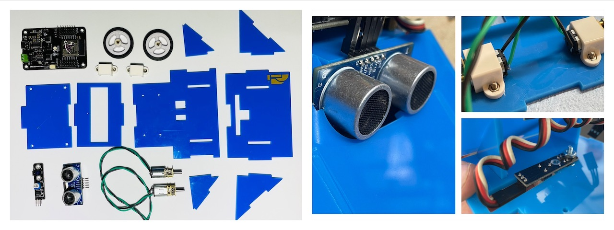

# Código y Diseños del Sumobot

El Sumobot es un robot simple pra competencias de sumobot. Fue diseñaro por Tomás de Camino Beck, para Universidad Cenfotec, como parte de un programa de trnasofrmación educativa, para ampliar capacidades de pensmaiento cpmputacional, tanto en estudiantes de colegio como en estudiantes de la universidad.

El Sumobot utiliza la placa [IdeaBoard](https://github.com/CRCibernetica/circuitpython-ideaboard/wiki), desarrollada por CrCiberética. esta placa tiene un ESP32.

Componetes del Sumobot:
- IdeaBoard (ESP32)
- 2 x Micro motores de 200rpm
- Sesnor IR
- Sensor ultrasónico de distanca (HCSR04)

## Sumobot_Chasis.svg

Archivo en formato SVG para corte láser del chasis de Sumobot.  Se puede cortar tanto en acrílico como MDF de 3mm

## code.py

El código base está desarrollado en CircuitPython. El Sumobot viene preparado para trabajar con Circuit Python. Si por alguna razón debe "reflashear" el IdeaBorad, siga las instrucciones en este [link](https://github.com/CRCibernetica/circuitpython-ideaboard/wiki/3.-Installation)
