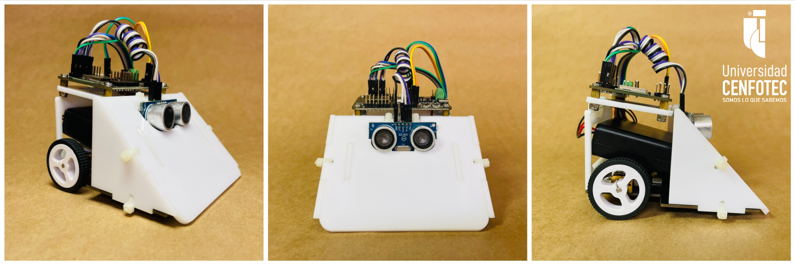
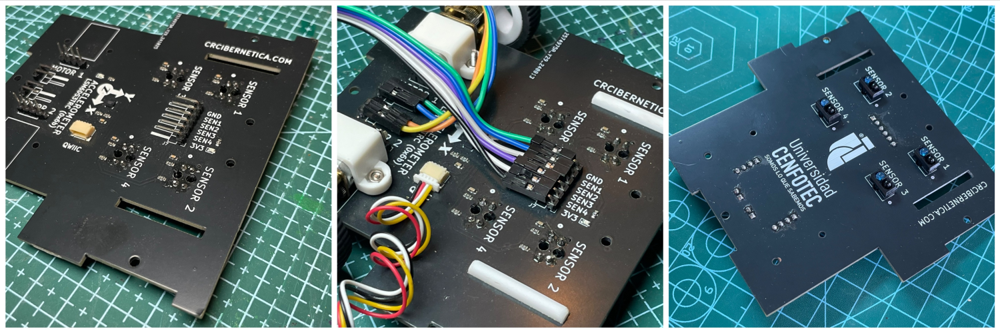
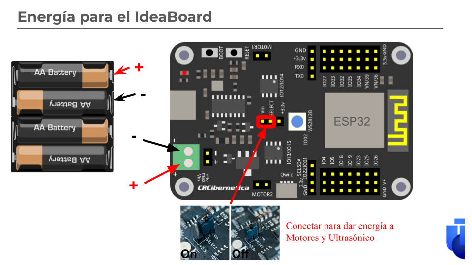

# Código y Diseños del Sumobot

El Sumobot es un robot simple, 100% desarrollado en Costa Rica, para competencias colegiales de Sumobot. Fue diseñado por el profesor Tomás de Camino Beck para la Universidad Cenfotec como parte de un programa de transformación educativa, con el objetivo de ampliar las capacidades de pensamiento computacional tanto en estudiantes de colegio como en estudiantes universitarios.

El Sumobot utiliza la placa [IdeaBoard](https://github.com/CRCibernetica/circuitpython-ideaboard/wiki), desarrollada por CrCibernética. Esta placa, que es Open Source, tiene un ESP32 como microcontrolador y facilita la conexión de sensores, motores y su programación a través de USB o Wi‑Fi.

Puede ver este [video resumen](https://youtu.be/L98O-mApjXQ) de la primera competencia de Sumobot de Costa Rica, celebrada en el Maker Faire San José 2023. Y acá pueden ver un [video resumen](https://youtu.be/9zarR0cKY90?si=D4UTzPx91h4megWT) de la segunda edición en el 2024

---
## Componentes del Sumobot 2025

¡Descubrí el nuevo SumoBot 2025!

El SumoBot de 2025 trae muchas mejoras respecto al modelo del 2024. Ahora tiene una nueva placa base especialmente diseñada para su chasis, lo que le da más fuerza y estabilidad. Además, el robot cuenta con cuatro sensores infrarrojos que le permiten detectar la línea blanca del dojo en diferentes posiciones, un acelerómetro y un giroscopio que mejoran su navegación y precisión.

También se mejoró la forma en que los motores se conectan al chasis, haciendo que el robot sea más confiable en las competencias y evitando los problemas de conexión que se dieron en el pasado.

¡Prepárate para construir, programar y competir con la nueva generación de SumoBots en el torneo 2025!

Todos los componentes se pueden encontrar en Costa Rica en [CrCibernética](https://www.crcibernetica.com/sumobot-universidad-cenfotec/).

---

## Chasis del Sumobot 2025

¿Cómo es el chasis del SumoBot?

El chasis del SumoBot es una placa PCB especial que ya incluye los sensores infrarrojos, el acelerómetro y el giroscopio. Todo está integrado para que sea mucho más fácil conectar los sensores directamente al microcontrolador y trabajar en tu robot sin complicaciones.

---

# Armando el Sumobot 2026

¿Qué tan fácil es armar el SumoBot? ¡Muy fácil! No necesitás pegamento ni materiales especiales: todo lo que ocupás viene incluido en el kit.
La única herramienta que vas a necesitar es un desatornillador Phillips para colocar la IdeaBoard en el robot, y un cautín para soldar los motores.
Todo lo demás se ensambla usando las tiras de plástico que ya vienen en el paquete.

¡Así que podés concentrarte en construir, programar y competir!

## Soldando motores

Los motores se sueldan al chasis y eso permie que queden bien asegurados y no se desconecten a pesar de los movimientos del robot.  Este es el paso que es un poco más difícil, sin embargo se puede hacer hasta si no tienes expeirencia soldando

[En este video se explica con detalle el soldado de motores](https://youtu.be/R4Um8DInFHk?si=ON4kUQGllQKRUqAh)

  
## Kit Sumobot 2025

El kit incluye:

1. Placa PCB que sirve como base del chasis.
2. Placa IdeaBoard con microcontrolador ESP32 (Hecho en Costa Rica por CrCibernetica)
3. Piezas del cuerpo del robot hechas en acrílico blanco.  
4. Tiras de plástico para el ensamblaje.  
5. Cables "jumper" para conexiones eléctricas.  
6. Cable Qwiic para conexión rápida de sensores.  
7. Sensor ultrasónico para detección de objetos.  
8. Caja para baterías AA.  
9. Motores Microgear de 200 RPM incorporados en la placa.

## Esquema de conexiones 2025

Una guia completa de las conexiones del SumoBot ls pueden encontrar en [este documento](https://github.com/Universidad-Cenfotec/Sumobot/blob/main/Guia%20de%20Conexiones%20Sumobot.pdf)

### Conexiones de las baterías a la IdeaBoard

Para darle energía a tu IdeaBoard del SumoBot, seguí estos pasos:

1. **Usá un portabaterías** con **4 baterías AA**.
2. **Cable rojo (+)** del portabaterías:
   - Conectalo al **terminal positivo (+)** de la placa IdeaBoard (marcado con un símbolo + en verde).
3. **Cable negro (-)** del portabaterías:
   - Conectalo al **terminal negativo (-)** de la placa IdeaBoard (marcado con un símbolo - en verde).
4. **Puente de energía (jumper)**:
   - Colocá el pequeño puente (jumper) rojo en el conector señalado en la imagen para **dar energía a los motores y al sensor ultrasónico**.

## Software para programar el Sumobot 2025

Para programar el Sumobot se utiliza Thonny, el cual se puede descargar desde este [enlace](https://thonny.org/).

### Instrucciones:
- Descargar la última versión de Thonny.
- Instalar.
- Una vez instalado, ir al menú "Herramientas > Opciones" o "Tools > Options" en inglés.
- En la pestaña "Intérprete" (o "Interpreter" en inglés), seleccionar "CircuitPython (Generic)".
- ¡Listo!
- [Video con detalles](https://youtu.be/Zc3oaAbVAdc)

## Código

El código "code.py" está desarrollado en CircuitPython. CircuitPython es un subconjunto de Python desarrollado para microcontroladores y facilita la portabilidad y programabilidad de dispositivos como el ESP32, entre otros. El Sumobot ya viene preparado para trabajar con CircuitPython y no es necesario cargar archivos adicionales. Si por alguna razón se debe "reflashear" el IdeaBoard, siga las instrucciones en este [enlace](https://github.com/CRCibernetica/circuitpython-ideaboard/wiki/3.-Installation).

El código "hcsr04.mpy" corresponde a la librería para el sensor de distancia, el cual se utiliza para detectar otro robot que esté al frente del Sumobot.

### Funciones Básicas

- **wiggle(t, n, speed):** Hace que el bot se mueva de izquierda a derecha durante _t_ segundos, a velocidad _speed_, repitiéndolo _n_ veces.
- **forward(t, speed):** Mueve el bot hacia adelante durante _t_ segundos a velocidad _speed_.
- **backward(t, speed):** Mueve el bot hacia atrás durante _t_ segundos a velocidad _speed_.
- **left(t, speed):** Mueve el bot hacia la izquierda durante _t_ segundos a velocidad _speed_.
- **right(t, speed):** Mueve el bot hacia la derecha durante _t_ segundos a velocidad _speed_.
- **stop():** Detiene el bot.
- **randomTurn(t, speed):** Gira al azar a la izquierda o a la derecha durante _t_ segundos a velocidad _speed_.
- **lookForward():** Realiza la lectura del sensor ultrasónico y retorna la distancia en cm de lo que esté en frente del bot.
- **scan():** Rota hacia un lado hasta que detecta algo adelante o hasta que gire un número determinado de veces.
- **forwardCheck(t, speed):** Mueve hacia adelante, pero verifica, mediante el sensor IR, que no se salga del dojo. Cuando detecta el borde, realiza un movimiento hacia atrás y luego gira.

### Recuperar la configuración inicial

Si por alguna razón se desea resetear el Sumobot a los archivos iniciales, cargue, a través de Thonny en el dispositivo CircuitPython (con el Sumobot conectado), todos los archivos que vienen en el archivo ZIP "SumoBot_Device_Files.zip".

---

## Videos Instructivos de Programación y Armado

Constantemente estaremos actualizando links cuando se vayan creando más videos:

- [Instalación de Thonny](https://youtu.be/Zc3oaAbVAdc?si=447Po0KyL_0hDAhJ)
- [Programación del Sumobot con Thonny](https://youtu.be/EOnnslZhL2c?si=rmjno9d8OHmJu21c)
- [Programación del NeoPixel](https://youtu.be/4abUHAFZwrY?si=RmHJYj71lK2cA2_J)
- [Programación de sensores Infrarrojos](https://youtu.be/1eArcnWW8Ek?si=TjnI8ONcFrolIb8A)
- [Programación de Motores](https://youtu.be/UMIWmT1n-kc?si=BwKY2DNXiGDF-0Ws)
- [Programación de Sensor Ultrasónico](https://youtu.be/RwY2lEPkyg8?si=KfbUV8WfN8I7yd2R)

---

# Reglas del Juego e Indicaciones del Torneo – SumoBot 2025

## DEFINICIONES:
1. **Sumobot:** El robot Sumobot es un robot de combate autónomo programado por el usuario, que deberá sacar a su rival del área de combate (dojo), ya sea empujándolo, arrastrándolo o dejándolo inhabilitado.
2. **Partida:** Enfrentamiento entre 2 robots de diferentes equipos, dividido en 3 combates.
3. **Maker Space:** Laboratorio de innovación de la Universidad CENFOTEC.
4. **GitHub:** Plataforma para crear proyectos abiertos de herramientas y aplicaciones, caracterizada, sobre todo, por sus funciones colaborativas que ayudan a que todos puedan aportar su granito de arena para mejorar el código.
5. **Mesa de arbitraje:** Persona o grupo de personas con autoridad, responsables de presidir el juego desde un punto de vista neutral y de tomar decisiones sobre la marcha que hagan cumplir las reglas de este reglamento.
6. **Dojo:** Área de combate, el espacio formado por la tarima circular y un espacio circundante denominado "área exterior de seguridad".
7. **Ronda:** Sistema en torneos en el que el perdedor de un encuentro queda inmediatamente eliminado de la competición, mientras que el ganador avanza a la siguiente fase. Se juegan rondas y, en cada una de ellas, se elimina a la mitad de los participantes hasta dejar un único competidor que se corona como campeón.

## ESPECIFICACIONES DEL ROBOT
- En Construcción

## Objetivo del Juego
El objetivo de cada robot Sumobot es expulsar a su oponente fuera del dojo, ya sea empujándolo, arrastrándolo o inmovilizándolo. Los combates se desarrollan de forma autónoma, basados en la programación del robot.

---

## Formato de Competencia

- El torneo se organiza en formato de eliminación directa.
- Cada encuentro entre dos robots se denomina **partida** y consta de **3 combates**.
- Cada combate tiene una duración máxima de **1 minuto y 30 segundos**.
- La primera ronda, el ganador recibe 3 puntos por ganar y 1 punto en caso de empate. En las rondas eliminatorias, el equipo que gane **al menos 2 de los 3 combates** avanza a la siguiente ronda.
- Entre cada combate hay **1 minuto de pausa** para ajustes técnicos o de estrategia.

---

##  Dinámica del Combate

- Los robots deben iniciar su comportamiento autónomo en la posición indicada por el juez.  
- Una vez que el juez indica que el combate inicia, ningún participante puede tocar el robot.
- Se consideran válidas tres acciones: **atacar**, **defender** y **buscar**.
- Cada robot gana un combate si:
  - Expulsa a su oponente completamente fuera de la línea blanca del dojo.
  - Su oponente no ejecuta movimientos durante el tiempo límite.
  - Su oponente queda inmovilizado por fallos mecánicos o por efecto del enfrentamiento.

---

## Configuración Inicial del Combate

Cada combate inicia con una disposición distinta:

1. **Frente a frente** a 10 cm de distancia.
2. **Espalda con espalda**.
3. **Lado a lado**, en direcciones opuestas.

---

## Revisión y Arbitraje

- Cada robot será inspeccionado antes del combate para asegurar que cumple con las **especificaciones técnicas**.
- La **mesa de arbitraje** será la autoridad principal y podrá tomar decisiones sobre disputas o situaciones no previstas.
- Un equipo puede ser descalificado si:
  - Realiza cambios estructurales no autorizados al robot.
  - No se presenta a su partida asignada.
  - Excede el peso permitido (260 g – 290 g).
  - Utiliza baterías, motores o neumáticos distintos a los del kit oficial.

---

## Progreso del Torneo

- El torneo comienza con una **fase de grupos**.
- A partir de la segunda ronda, la competición es de eliminación directa.
- En caso de empate total en una partida, el ganador será decidido por **lanzamiento de moneda**.
- Se podrá seleccionar un número determinado de **"mejores segundos lugares"** para avanzar en el torneo, si así lo definen los organizadores.

---

##  Sanciones y Ausencias

- Si un equipo no se presenta a un combate, el equipo contrario gana automáticamente.
- Si ningún equipo se presenta, se escogerán equipos sustitutos de entre los mejores perdedores.
- Un equipo que llegue tarde pierde automáticamente su primer combate, pero puede competir en los siguientes.

---

##  Espíritu del Torneo

Este torneo busca fomentar el aprendizaje, la creatividad y el trabajo en equipo. Se permite el apoyo entre equipos y la colaboración con docentes, siempre motivando a que sean los estudiantes quienes lideren el diseño, armado y programación del robot.

---

##  Preguntas Frecuentes

1. **¿Se puede modificar el código del robot?**
   - Sí, el código puede ser adaptado libremente.

2. **¿Se pueden agregar sensores?**
   - Sí, siempre y cuando no impliquen modificaciones estructurales al robot, y no exceda el peso permitido.

3. **¿Se puede modificar el chasis o los motores?**
   - No. Las partes estructurales, motores, ruedas y baterías deben permanecer como en el kit oficial.

4. **¿Los estudiantes deben llevar el código memorizado?**
   - No, pueden llevarlo preparado y modificarlo durante el evento. Se les proporcionará equipo si no tienen acceso a uno.

---

---

[Nombre del proyecto]

# Licencia

Sumobot es un robot desarrollado con el propósito de potenciar el aprendizaje de computación en colegios. Este proyecto está abierto a contribuciones y estamos encantados de recibir nuevas ideas.

Este robot está protegido por una licencia Creative Commons. Específicamente, se trata de la licencia CC BY‑NC‑SA 4.0, que significa Atribución‑NoComercial‑CompartirIgual 4.0 Internacional.

Bajo esta licencia, se permite el uso, distribución y modificación del robot, pero con las siguientes condiciones:
- **Atribución** — Debes dar el crédito correspondiente, proporcionar un enlace a la licencia e indicar si se han realizado cambios.
- **NoComercial** — No puedes utilizar el material para una finalidad comercial.
- **CompartirIgual** — Si remezclas, transformas o creas a partir del material, debes distribuir tus contribuciones bajo la misma licencia que el original.

Para obtener más detalles sobre la licencia, por favor visita [https://creativecommons.org/].

# Contribuciones

Si estás interesado en contribuir al Sumobot, por favor revisa las guías de contribución disponibles en la sección de "Documentación". Todas las contribuciones son bienvenidas, sin importar cuán pequeñas sean. Juntos podemos hacer que Sumobot sea mejor para todos.

