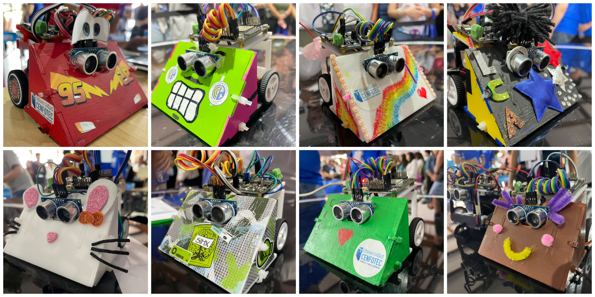

# ¿Que es el SumoBot de CENFOTEC? (o CenfoBot)

El Sumobot es un robot simple, 100% desarrollado en Costa Rica, para competencias colegiales de Sumobot. Fue diseñado por el profesor Tomás de Camino Beck para la Universidad Cenfotec como parte de un programa de transformación educativa, con el objetivo de ampliar las capacidades de pensamiento computacional tanto en estudiantes de colegio como en estudiantes universitarios.

> [En este enlace puede leer sobre la historia del Sumobot en sus 3 primeros años](https://crhoy.com/sumobot-una-historia-de-tecnologia-hecha-en-costa-rica/)  
> [Articulo técnico del Sumobot como platafomra de enseñanza](https://www.researchgate.net/publication/400625563_El_Sumobot_como_herramienta_de_aprendizaje_tecnologico_diseno_implementacion_y_evaluacion_en_torneos_colegiales)

El Sumobot utiliza la placa [IdeaBoard](https://github.com/CRCibernetica/circuitpython-ideaboard/wiki), desarrollada por CrCibernética. Esta placa de código abierto (Open Source) incorpora un microcontrolador ESP32 y permite la conexión sencilla de sensores y motores, así como su programación mediante USB o Wi‑Fi.

Para el montaje del robot, se emplea un *shield* de robótica especialmente diseñado por la Universidad CENFOTEC (por el profesor Tomás de Camino Beck) en colaboración con CrCibernética. Este componente puede [adquirirse en este enlace](https://www.crcibernetica.com/sumobot-shield/).

Puede ver este [video resumen](https://youtu.be/L98O-mApjXQ) de la primera competencia de Sumobot de Costa Rica, celebrada en el Maker Faire San José 2023. Y acá pueden ver un [video resumen](https://youtu.be/9zarR0cKY90?si=D4UTzPx91h4megWT) de la segunda edición en el 2024, y de la [tercera edición 2025](https://youtu.be/qRWDWPndxq8?si=iimM-hLvY60RDaJC)

[Documento técnico explicando los elementos pedagógicos del Sumobot](https://www.researchgate.net/publication/400625563_El_Sumobot_como_herramienta_de_aprendizaje_tecnologico_diseno_implementacion_y_evaluacion_en_torneos_colegiales)

---

## Contenidos de este Repositorio

- [Componentes del Sumobot](https://github.com/Universidad-Cenfotec/Sumobot/blob/main/componentes2025.md)
- [Armado del Sumobot](https://github.com/Universidad-Cenfotec/Sumobot/blob/main/Armado%20paso%20a%20paso.md)
- [Conexiones del Sumobot](https://github.com/Universidad-Cenfotec/Sumobot/blob/main/conecciones.md)
- [Programación del Sumobot](https://github.com/Universidad-Cenfotec/Sumobot/blob/main/programacion.md)
- [Un buen código de inicio con explicaciones](https://github.com/Universidad-Cenfotec/Sumobot/tree/main/c%C3%B3digos_de_ejemplo/codigo%20inicio)
- [Códigos de ejemplo y códigos IdeaBoard](https://github.com/Universidad-Cenfotec/Sumobot/tree/main/c%C3%B3digos_de_ejemplo)
- [Sobre los 4 sensores infrarrojos](https://github.com/Universidad-Cenfotec/Sumobot/blob/main/c%C3%B3digos_de_ejemplo/sensores_infrarrojos.md)
- [Cómo calibrar los sensores infrerrojos, grabando los datos](https://youtu.be/5G9ZTyPEq5s?si=Cqf4HQZEF9e04VTD)
- [Especificaciones del Dojo](https://github.com/Universidad-Cenfotec/Sumobot/blob/main/dojo.md)
- [Reglas del Torneo Sumobot](https://github.com/Universidad-Cenfotec/Sumobot/blob/main/reglas%20de%20competencia.md)
- [Preguntas frecuentes](https://github.com/Universidad-Cenfotec/Sumobot/blob/main/FAQ.md)
- [Playlist de Videos de Sumobot](https://www.youtube.com/watch?v=Cxlyzh-E9kE&list=PLySA0noR1JGVZg5L3hGVwRD3PP2ibNYMT)

## Contenidos Avanzados
- [Programación en C/C++ (Avanzado)](https://github.com/Universidad-Cenfotec/Sumobot/tree/main/c%C3%B3digos_de_ejemplo_c%2B%2B/sumobot)
- [Control PDI de motores y navegación](https://github.com/Universidad-Cenfotec/Sumobot/blob/main/c%C3%B3digos_de_ejemplo/Control_Movimientos.md)
- [Almacenamiento de datos en el robot para análisis posterior](https://github.com/Universidad-Cenfotec/Sumobot/blob/main/c%C3%B3digos_de_ejemplo/almacenando_datos.md)
- [Ejemplo de automatización de vehiculos asistidos](https://github.com/Universidad-Cenfotec/Sumobot/tree/main/c%C3%B3digos_de_ejemplo/AGVs)
- [Sumobot con planificación autónoma con Modelos de Lenguajes (Gemini)](https://github.com/Universidad-Cenfotec/Sumobot/tree/main/c%C3%B3digos_de_ejemplo/LLM_in_the_Loop_Robotics)
- [Programación del Sumobot con bloques a través de una aplicación web](https://github.com/Universidad-Cenfotec/Sumobot/tree/main/c%C3%B3digos_de_ejemplo/codigo_bloques)

## Asistente IA para programar el Sumobot

- [GPT entrenado para programación Sumobot](https://chatgpt.com/g/g-6863f71f27b8819192a51ed05df367b0-asistente-de-programacion-sumobot-cenfotec)

## Retos

- Hacer una estrategia de "scan" del contrincante más eficiente
- Hace movimientos oscilatorios para tratar de levantar al oponente
- Utilizar giroscopios para movimientos exactos ([ver este código](https://github.com/Universidad-Cenfotec/Sumobot/blob/main/c%C3%B3digos_de_ejemplo/Control_Movimientos.md))
- Utilizar el "botón 0" para que arranque el robot apenas suelten el botón ([ver este código](https://github.com/Universidad-Cenfotec/Sumobot/blob/main/c%C3%B3digos_de_ejemplo/code_boton0.py))
- Entender que cada combate inicia diferente y aprovechar esas posiciones
- Estudiar comportameinto de sensores almacenando los datos ([ver este código](https://github.com/Universidad-Cenfotec/Sumobot/blob/main/c%C3%B3digos_de_ejemplo/almacenando_datos.md))

## Algunos Saberes Escenciales de el Sumobot

| Área de Conocimiento                     | Saberes Esenciales                                                                     | Ejemplos desde el Kit Sumobot                                                                              |
| ---------------------------------------- | -------------------------------------------------------------------------------------- | ---------------------------------------------------------------------------------------------------------- |
| **1. Pensamiento Computacional**         | - Estructuras de control - Modularidad - Algoritmos - Programación de eventos | `code.py`, `retroceso.py`, `code_boton0.py`, `code_set_pixel_to.py`, uso de funciones en todos los scripts |
| **2. Robótica y Electrónica**            | - Lectura de sensores - Control de motores - Interacción hardware-software  - Precepción del entorno   - Calibración de sensores    - Interacción con otros agentes   - Menjo de incertidumbre  | `code_ultrasonic.py`, `code_acc_motor_move.py`, `Control_Movimientos.md`, `Pixel_colores.py`               |
| **3. Ciencia de Datos**                  | - Registro de datos - Análisis y visualización - Experimentación  - Desiciones basadas en datos                | `code_storage.py`, `code_storage_IR.py`, `almacenando_datos.md`, ejemplo de uso con Google Sheets          |
| **4. Matemáticas Aplicadas**             | - Lógica binaria - Cálculo de gradientes - Estimación de distancia  - Sistemas de control  - Integral y derivada              | `code_lecturaIR_4Bit.py`, `code_gradiente.py`, `Calculo _Gradiente.md`, `code_ultrasonic.py`               |
| **5. Ingeniería de Sistemas**            | - Diseño e integración de componentes - Diagnóstico y prueba de sistemas  - Verificación de errores  - Interacción humano máquina  - Sistemas complejos   - Programación Asistida IA  - Inteligencia Artificial         | `code_diagnostic.py`, `SumoBot_Device_Files.zip`, `movimiento_base.md`, `libreria IdeaBoard.md`            |
| **6. Habilidades Transversales (STEAM)** | - Resolución de problemas - Trabajo en equipo - Comunicación técnica  - Autodeterminación            | Uso de Markdown (`*.md`), documentación clara, posibilidad de trabajo colaborativo y creativo con el robot |

---

# Una plataforma Open Source

## ¿Por qué un robot open source?

El Sumobot fue diseñado como una plataforma educativa abierta para el aprendizaje de robótica, programación y sistemas autónomos. Un robot open source permite que cualquier persona —estudiantes, docentes, clubes de robótica o investigadores— pueda construirlo, modificarlo y adaptarlo a sus propias necesidades.

En robótica educativa es fundamental que los estudiantes no solo usen la tecnología, sino que puedan comprender cómo funciona. Un robot abierto permite estudiar todos sus componentes: electrónica, sensores, control de motores, algoritmos de comportamiento y diseño mecánico. Esto convierte al robot en un laboratorio completo de aprendizaje.

Además, un diseño abierto reduce las barreras de acceso. Las instituciones educativas pueden reproducir el robot localmente utilizando componentes accesibles, lo que facilita su adopción en escuelas y colegios.

## ¿Por qué el diseño open source?

El diseño mecánico del robot también es abierto para que pueda ser reproducido mediante fabricación digital. Esto incluye archivos de diseño que permiten imprimir o fabricar las piezas del robot en impresoras 3D, cortadoras láser u otros métodos de fabricación.

Esto tiene varias ventajas educativas y técnicas:

* Permite que los estudiantes comprendan cómo el diseño físico afecta el comportamiento del robot.
* Facilita modificaciones y mejoras en la estructura del robot.
* Permite adaptar el robot a diferentes materiales o tecnologías de fabricación.
* Promueve la cultura *maker* y la experimentación.

Un robot de competencia no es solo software; el diseño físico influye directamente en su desempeño en el dojo. Tener el diseño abierto permite explorar estas decisiones de ingeniería.

## ¿Por qué el código open source?

El comportamiento del robot es controlado por software. Hacer el código open source permite que los estudiantes y participantes del torneo puedan estudiar cómo se toman las decisiones dentro del robot.

Esto permite:

* Aprender algoritmos de control para robots autónomos.
* Experimentar con diferentes estrategias de combate.
* Comprender cómo se integran sensores, actuadores y lógica de decisión.
* Desarrollar nuevas versiones del comportamiento del robot.

El objetivo no es que todos los robots ejecuten exactamente el mismo programa, sino que cada equipo pueda desarrollar su propia estrategia a partir de una base común.

## ¿Por qué un torneo open source?

El torneo también se basa en una filosofía abierta. En lugar de esconder las tecnologías o estrategias, se promueve compartir conocimiento entre equipos, docentes y estudiantes.

Esto genera varios beneficios:

* acelera el aprendizaje colectivo
* permite mejorar el robot y el torneo con el tiempo
* fomenta la colaboración entre instituciones
* convierte el torneo en una comunidad de aprendizaje

El objetivo del torneo no es solo competir, sino aprender robótica de forma práctica. Cada edición del torneo genera nuevas mejoras en el robot, en el código y en las estrategias de control.

De esta manera, el Sumobot no es solo un robot ni solo una competencia. Es una plataforma abierta de aprendizaje en robótica.

---

# Licencia

Sumobot es un robot desarrollado con el propósito de potenciar el aprendizaje de computación en colegios. Este proyecto está abierto a contribuciones y estamos encantados de recibir nuevas ideas.

Este robot está protegido por una licencia Creative Commons. Específicamente, se trata de la licencia CC BY‑NC‑SA 4.0, que significa Atribución‑NoComercial‑CompartirIgual 4.0 Internacional.

Bajo esta licencia, se permite el uso, distribución y modificación del robot, pero con las siguientes condiciones:
- **Atribución** — Debes dar el crédito correspondiente, proporcionar un enlace a la licencia e indicar si se han realizado cambios.
- **NoComercial** — No puedes utilizar el material para una finalidad comercial.
- **CompartirIgual** — Si remezclas, transformas o creas a partir del material, debes distribuir tus contribuciones bajo la misma licencia que el original.

Para obtener más detalles sobre la licencia, por favor visita [https://creativecommons.org/].

# Contribuciones

Si estás interesado en contribuir al Sumobot, por favor revisa las guías de contribución disponibles en la sección de "Documentación". Todas las contribuciones son bienvenidas, sin importar cuán pequeñas sean. Juntos podemos hacer que Sumobot sea mejor para todos.

