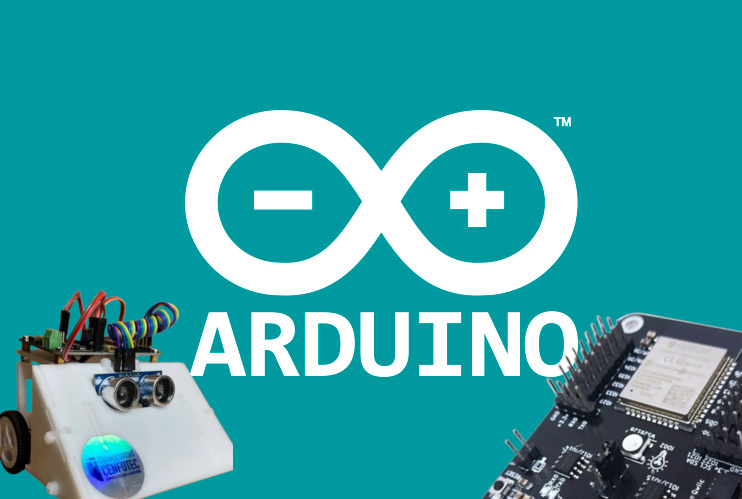

# C++ con el FrameWork de Arduino 🍝
C++ es un versátil lenguaje de "bajo nivel", lo que significa que habla casi directo con los circuitos del chip. El framework de Arduino funciona como un traductor amigable que envuelve a C++ para que no tengas que ser un genio de la computación para encender un LED, este se encarga de exponer funciones útiles como lecturas de pines, comunicación Serial, Etc.

# Programar el IdeaBoard con C/C++

## Instalación de Arduino IDE
Para programar el ideaboard con C/C++ puede utilizar el Arduino IDE. [En este video se Explica como instalar y utilizar el Arduino IDE](https://youtu.be/Gd5cj3yKtPM?si=9Gexbs7unJ-1I55R)

## Dirección de Pines del IdeaBoard
Todos sketchs usan las conexiones estandar que se encuentran en el archivo [conexiones.md](https://github.com/Universidad-Cenfotec/Sumobot/blob/main/conexiones.md) para el sumobot version 2025.

Ya que no se está usando la libreria ideaboard.py para la desobfuscación de ciertos pines, tienes que referirte a los pines del ESP32 conectada a la placa en el código 

