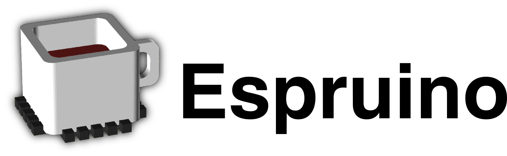

# ☕ Espruino 🟡


Espruino es un **intérprete de JavaScript para microcontroladores**. Permite programar placas como ESP32 usando **JavaScript directamente**, sin necesidad de compilar código en C/C++ como en Arduino.

La idea principal de Espruino es hacer el desarrollo **rápido, interactivo y educativo**, muy similar a trabajar con Python en MicroPython o CircuitPython, pero usando JavaScript.

Estos ejemplos usan **Espruino** como entorno principal para controlar el **SumoBot de la Universidad CENFOTEC con** la **IdeaBoard de CRCibernética**.

---

## ¿Por qué usar Espruino?

* ✅ JavaScript real (no es un lenguaje nuevo)
* ✅ REPL interactivo (ejecutar código en vivo)
* ✅ Ideal para educación y prototipado rápido
* ✅ Compatible con ESP32, ESP8266, STM32, entre otros
* ✅ Soporta módulos reutilizables

Si ya sabes JavaScript para web, **la curva de aprendizaje es muy baja**.

---

## Instalación del firmware de Espruino

Antes de usar Espruino, la placa debe tener el **firmware de Espruino** instalado.

Para el *ESP32* esto es bastante directo, se puede usar el flasher en linea que que provee [Espruino](https://www.espruino.com/Espressif+Flash)

---

## Editores disponibles

Espruino puede usarse de varias formas, dependiendo de tu estilo de trabajo.

---

### 🌐 Editor Web de Espruino

Disponible en:

[https://www.espruino.com/ide/](https://www.espruino.com/ide/)

Características:

* Editor en el navegador
* Consola REPL integrada
* Envío de código en tiempo real
* Soporte automático para módulos

Ideal para:

* Pruebas rápidas
* Clases
* Primeros pasos

---

### 🖥️ IDE de Escritorio (Espruino IDE)

Aplicación de escritorio (Windows, Linux, macOS).

Ventajas:

* Mejor manejo de archivos
* Soporte para proyectos grandes
* Carga de módulos locales
* Consola estable

Recomendado cuando el proyecto empieza a crecer.

---

## Módulos en Espruino

Espruino soporta el uso de módulos mediante `require()`, similar a Node.js.

```js
const ib = require("ideaboard").connect();
```

Existen **tres formas principales** de usar módulos.

---

### 1️⃣ Módulos desde Internet (Repositorio oficial)

Espruino tiene un **repositorio oficial de módulos**.

Cuando haces:

```js
require("HC-SR04")
```

El IDE:

* Descarga el módulo automáticamente
* Lo guarda en la placa
* Lo ejecuta en memoria

✔ Fácil
✔ Rápido
✔ Ideal para aprendizaje

⚠️ Requiere conexión a internet

---

### 2️⃣ Módulos locales (IDE de Escritorio exclusivamente)

Puedes descargar un módulo manualmente y usarlo desde tu computadora.
Para esto debes seguir los paso en esta parte de la [documentación](https://www.espruino.com/Modules#from-a-local-folder), aunque se avisa que esté se encuentra en inglés y contiene lenguaje técnico.

Ejemplo:

```js
require("./ideaboard.js")
```

Ventajas:

* Funciona sin internet
* Control total del código
* Ideal para desarrollo y depuración

---

### 3️⃣ Módulos subidos al almacenamiento de la placa

También puedes **subir archivos `.js` directamente a la memoria interna** de la placa.

Ejemplo:

```js
require("ideaboard")
```

⚠️ Importante:

* El **editor puede marcar errores** (archivo no encontrado)
* El **código SÍ funcionará correctamente en la placa**
* Es una limitación del análisis estático del editor
* Para usarlo como otro modulo, deben ser guardados sin la extensión **.js**

Este método es común en proyectos finales o distribuidos.

---

## Diferencias clave con Arduino

| Arduino     | Espruino            |
| ----------- | ------------------- |
| Compilación | Interpretado        |
| C / C++     | JavaScript          |
| Carga lenta | Ejecución inmediata |

En Espruino, un loop típico se ve así:

```js
setInterval(function () {
  // código repetitivo
}, 50);
```

Esto es equivalente a:

```python
while True:
    pass
```

---

## Recursos útiles

* Documentación oficial: [https://www.espruino.com/Reference](https://www.espruino.com/Reference)
* IDE Web: [https://www.espruino.com/ide/](https://www.espruino.com/ide/)
* Repositorio de módulos: [https://www.espruino.com/Modules](https://www.espruino.com/Modules)

---

✨ Si vienes de Arduino, MicroPython o CircuitPython, Espruino es una forma excelente de **pensar diferente**, sin dejar de aprender electrónica y robótica.

<pre>
 _____                 _
|   __|___ ___ ___ _ _|_|___ ___
|   __|_ -| . |  _| | | |   | . |
|_____|___|  _|_| |___|_|_|_|___|
          |_|
</pre>
